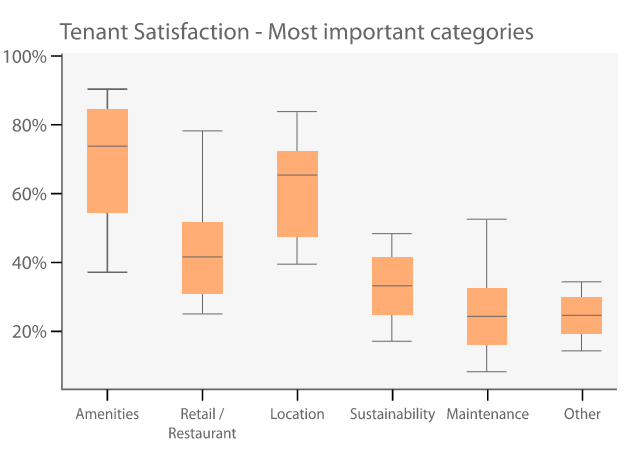
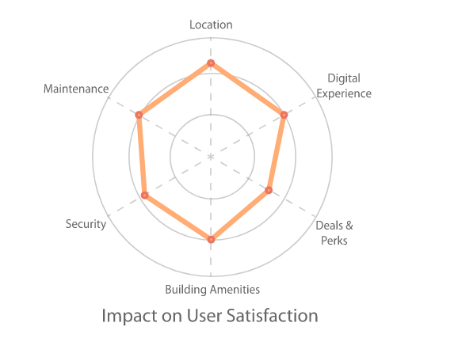

# HqO_Dashboard

A dashboard for the HqO company's clients to provide insight into how their 
building summary

## Introduction 

HqO is a platform/app that helps landlords (of commercial office buildings) 
create a better experience for their customers (people who work in those 
buildings). 
Imagine working in a campus or a large building, and having an all-in-one app 
that contains your entry badge, latest info on COVID regulation for the gym, 
working hours of the coffee kiosk on level 4, and deals for the nearby taco shop.
What does this do? Happier people in these buildings means happier tennants, and 
that in turn means higher rents and longer leases. 
Happier employee, happier employers, and happier landlords!

## Benchmarking

The real estate market is a closed off sector - you can find rental info for the 
residential market on redfin and zillow and their like, but even then, 
it’s not that easy to understand what factors lead to satisfaction. The 
commercial market is even more complicated because the inventory is different, 
and the tenants are different - so imagine what a dashboard like this can do in 
terms of improving the everyday of everyone who works in these buildings. 
The goal here is to help owners understand what properties each building has, and 
show them how they compare to their competitors. 

## Elements

Data is coming from HqO servers as tables, and the folder data includes a step 
by step guide on how to preprocess it. As a part of that process, two machine 
learning models shall be trained on our data:
- A Kmeans model to cluster our buildings
- A regression model trained on the user satisfaction column

As the number of buildings grows, the regression model should be trained on 
subsets of the data (ie. on buildings in the same city) to report back what 
specific factors are important in each of our comparison groups. With the 
current size of our data set, it is my recommendation to train the model only 
on the full data set, and instead define a metric to count for importance of
each feature, the sdt of that feature in the data set, and the diferrence of 
mean of that feature in our subset with mean of it for buildings in the set that
are reported to have a score above a desired level.

In a second folder called city data, I have provided the source for city shapefiles that were used to create the map that zooms into one city.

## Plots
In the folder "plots" I have defined functions to draw diagrams showcasing the 
data we are looking at. Here is an example of the tenant satisfaction factors
(from gathered data from users) as a box plot:

&nbsp;

and here is an example of a polar diagram showing coefiicients (feature 
importance) of the model mentioned before:

&nbsp;

## Dashboard

To put it all together, I have used the streamlit library to create a mock up
dashboard. The streamlit webpage does not have all the features in the images 
below, but it gets very close in providing a base to work with.

&nbsp;

